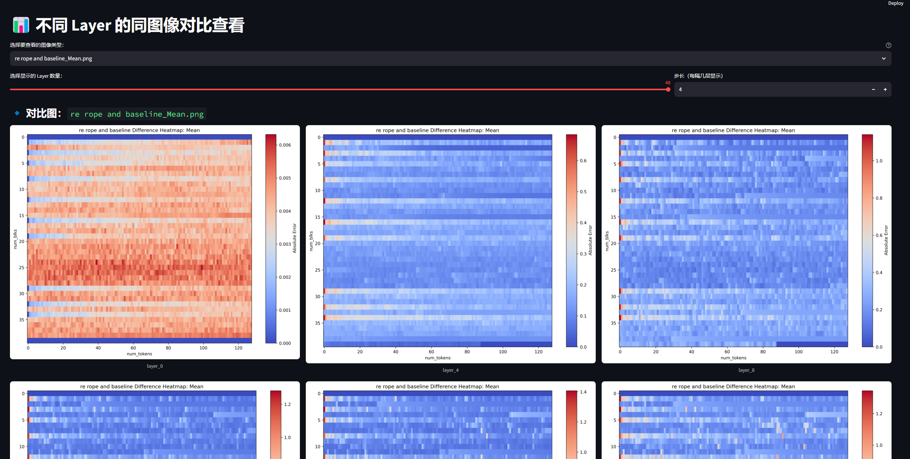

## introduction
this project mainly visualize the 2-dim tensor difference for compare the kv cache in vllm and attn_mask etc. \
as follows: we can compare the kv cache difference between baseline and modified version.\

## dump kv caches after the prefill stage(model first forward finished)
generally while running vllm, we put a breakpoint at the next line of the following code in gpu_model_runner.py.
```python
model_output = self.model(
    input_ids=input_ids,
    positions=positions,
    intermediate_tensors=intermediate_tensors,
    inputs_embeds=inputs_embeds,
)
```           
then, we execute the following code in console to dumped the produced kv caches .
```python
num_blks = attn_metadata['model.layers.0.self_attn.attn'].seq_lens[0].item()//128 + 1
num_blks
for layer_id, layer_cache in enumerate(self.kv_caches):
    his_kv = layer_cache[:,attn_metadata['model.layers.0.self_attn.attn'].block_table[0][:num_blks]]
    torch.save(his_kv, f"/home/whx/vllm-workspace/dumped_tensors/no_rope/layer_{layer_id}_kv.pt")
```           

## compare kv caches
when we get the dumped kv cache tensor for each setting, we can calculate the deviation of the kv_caches. \
mainly, we get the deviation of each layer by subtraction, then we can get the mean, std, ... statistic values . \
finally, we reshape the deviation tensor as (num_blocks , num_tokens), so we can paint it using plt and save as pngs. \
just run the analyse.py to process the kv cache tensors

## better view the pngs using streamlit
as we have visualization pngs for each layer, normally we would compare the pngs at different level, \
such as in each layer, the comparison of different method, \
or for the exact method, the changes over different layer. \
we just using streamlit for visualization and sharing as service.
```bash
streamlit run .\viewer.py --server.address 127.0.0.1 --server.port 8501
streamlit run .\viewer_per_compare.py --server.address 127.0.0.1 --server.port 8502
```


